<div align="center">
  <a href="#readme-top"></a>
  
  <!-- 占位符：应用 Logo / Banner -->
  <!-- 建议图片：1024×500 的横幅图，左侧为应用图标，右侧为应用名称 "Termix" 及标语 -->
  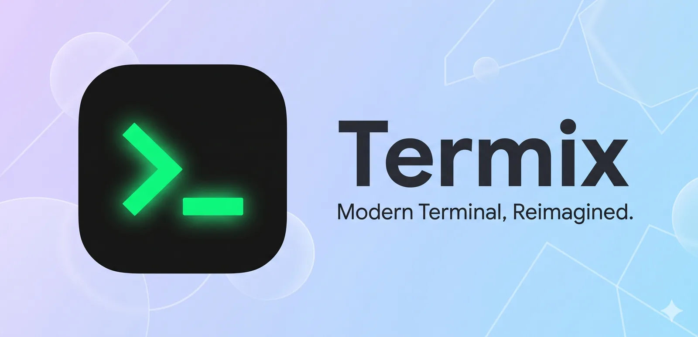

  <h1>Termix</h1>
  <p><strong>一款现代化、Material 3 风格的 Android 终端模拟器</strong></p>

  <p>
    <a href="https://github.com/jeffusion/Termix/releases">
      
    </a>
    <a href="https://github.com/jeffusion/Termix/blob/main/LICENSE">
      
    </a>
    <a href="https://github.com/jeffusion/Termix/actions">
      
    </a>
    
  </p>

  <p>
    <a href="README.md">English</a>
  </p>
</div>

---

## 目录

- [项目简介](#项目简介)
- [核心功能](#核心功能)
- [界面截图](#界面截图)
- [下载与安装](#下载与安装)
- [技术栈](#技术栈)
- [自行构建](#自行构建)
- [贡献指南](#贡献指南)
- [开源许可](#开源许可)
- [致谢](#致谢)

---

## 项目简介

**Termix** 是一款专为 Android 设计的现代化终端模拟器，采用 [Material Design 3](https://m3.material.io/) 设计语言，旨在成为经典 [Jackpal Android Terminal Emulator](https://github.com/jackpal/Android-Terminal-Emulator) 的现代化替代方案。

Termix 基于 [Termux](https://github.com/termux/termux-app) 强大且经过实战检验的 `TerminalView` 构建，提供流畅的终端渲染体验和完整的键鼠支持。项目 fork 自 [ReTerminal](https://github.com/RohitKushvaha/ReTerminal)，并在其基础上持续演进，加入了更现代的 UI、更丰富的自定义选项以及对多种 Linux 环境的原生支持。

> **提示**：本项目目前处于积极开发阶段，欢迎提交 Issue 和 PR 参与共建！

---

## 核心功能

### 终端体验
- **高性能终端渲染**：基于 Termux TerminalView，支持真彩、256 色及标准 16 色终端配色
- **多会话管理**：同时运行多个终端会话，支持通过侧边栏抽屉或顶部 Tab Bar 快速切换
- **虚拟按键栏**：内置可滑动的虚拟按键（ESC、CTRL、ALT、方向键、HOME、END、PGUP、PGDN 等），方便在无实体键盘的设备上操作
- **键盘快捷键**：支持完全自定义的键盘快捷键，包括粘贴、新建/关闭会话、切换会话等操作
- **会话持久化**：通过前台服务保持会话在后台运行，切换应用不丢失状态

### 多环境支持
Termix 内置了对多种运行环境的支持，无需复杂配置即可在 Android 上体验完整的 Linux 命令行：
- **Alpine Linux**：轻量级、高效的容器化环境
- **Arch Linux ARM**：功能丰富的滚动发行版（ARM 架构）
- **Android Shell**：直接使用设备原生 Shell
- **Root 模式**：在支持 Root 的设备上，可直接以 Root 权限运行 Alpine 或 Arch 环境

### 深度自定义
- **配色方案**：内置多款精选终端配色，支持根据系统深色模式自动切换，并允许通过 `colors.properties` 进行高级自定义
- **自定义字体**：支持导入任意 `.ttf` 字体文件，打造专属终端显示风格
- **自定义背景**：支持设置终端背景图片，并可独立调节透明度
- **界面布局**：提供「经典抽屉」和「顶部标签栏」两种布局模式
- **主题引擎**：原生支持 Android Monet 动态取色、AMOLED 纯黑深色模式
- **回滚缓冲**：可配置终端回滚行数（500 ~ 50,000 行）
- **默认 Shell**：支持选择 Bash、Ash 或 Zsh 作为默认 Shell

### 其他特性
- **Edge-to-Edge 沉浸布局**：充分利用屏幕空间，状态栏与导航栏自动适配
- **崩溃处理**：内置崩溃捕获与日志记录机制，提升稳定性
- **Fastlane 支持**：已配置 Fastlane 元数据，便于在 F-Droid 等应用商店分发

---

## 界面截图

Termix 同时支持 **手机模式** 与 **电脑模式** 两种布局，下面的截图分别展示了两种模式下的实际界面效果。

### 手机模式

<div align="center">
  <table>
    <tr>
      <td align="center">
        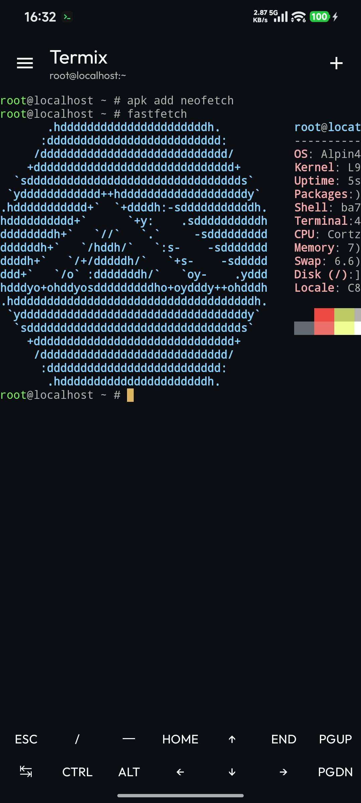
        <br/><sub>主终端界面</sub>
      </td>
      <td align="center">
        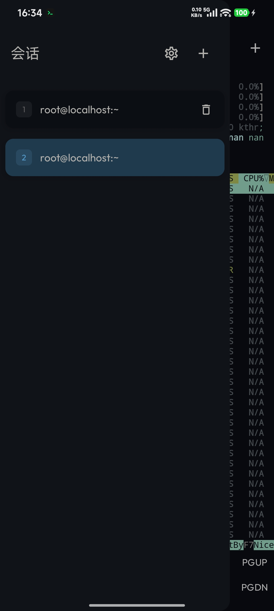
        <br/><sub>多会话管理</sub>
      </td>
      <td align="center">
        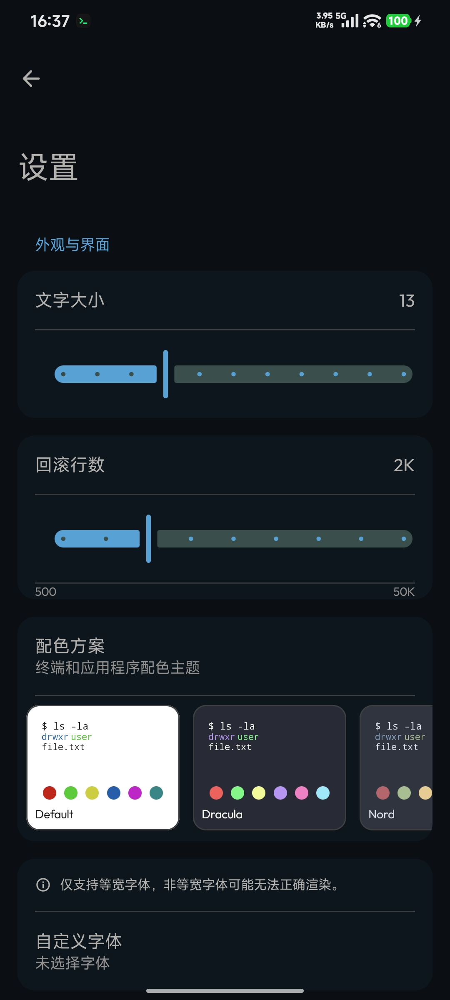
        <br/><sub>设置界面</sub>
      </td>
    </tr>
    <tr>
      <td align="center">
        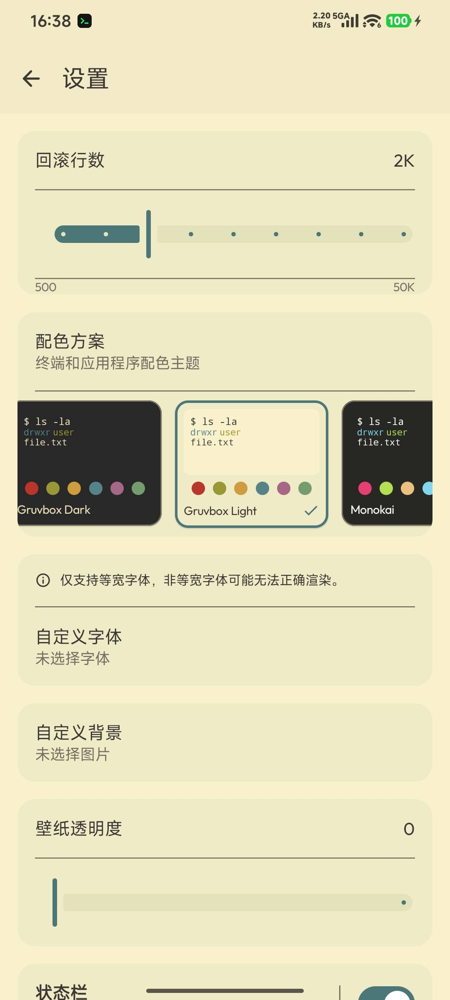
        <br/><sub>配色方案</sub>
      </td>
      <td align="center">
        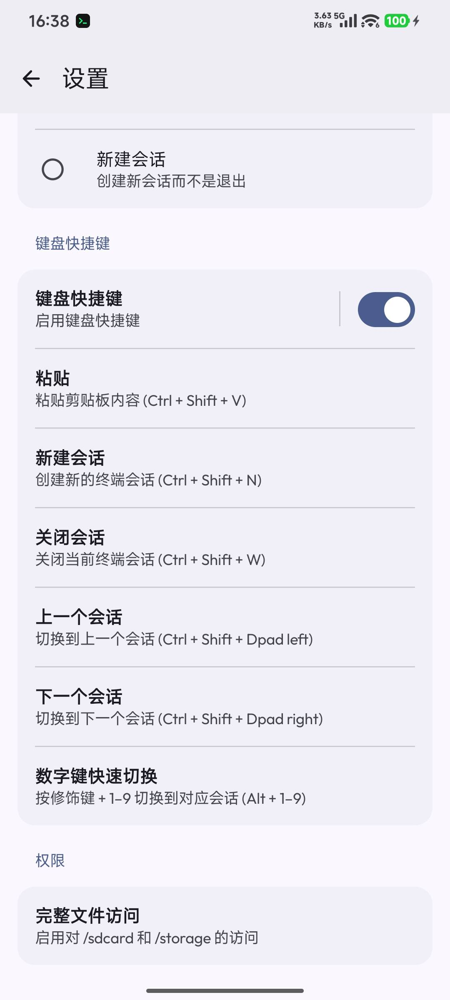
        <br/><sub>键盘快捷键</sub>
      </td>
      <td align="center">
        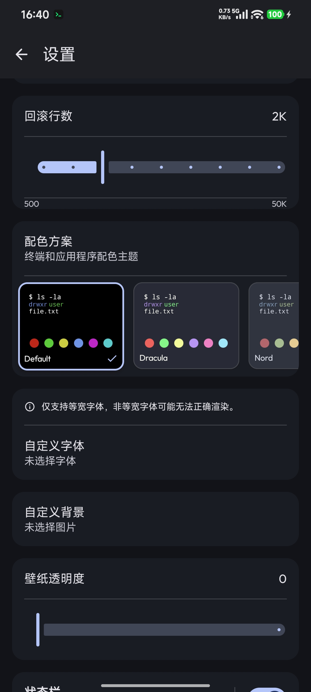
        <br/><sub>深色主题</sub>
      </td>
    </tr>
  </table>
</div>

### 电脑模式

<div align="center">
  <table>
    <tr>
      <td align="center">
        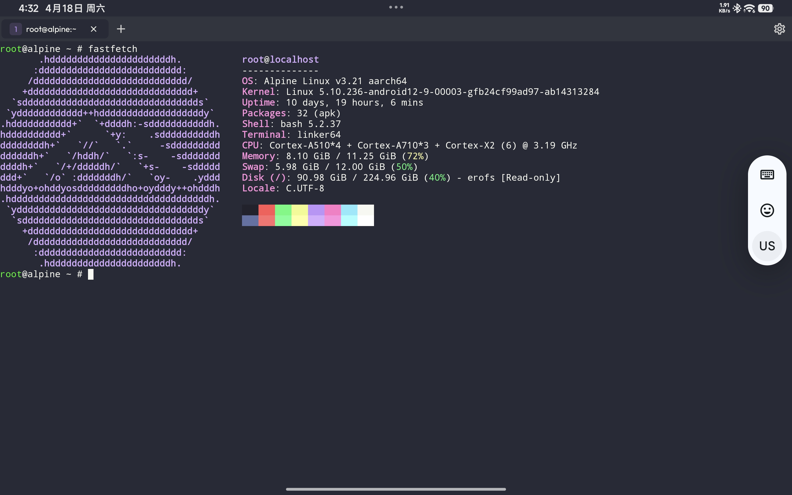
        <br/><sub>主终端界面</sub>
      </td>
      <td align="center">
        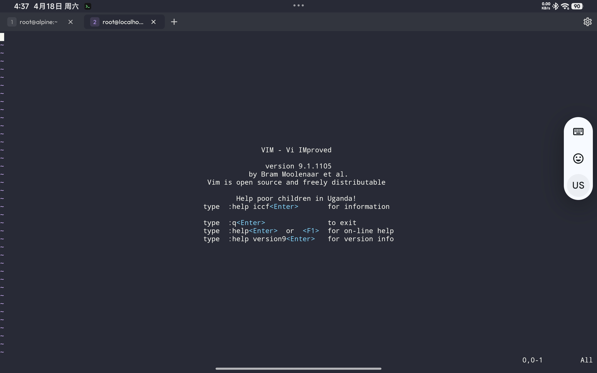
        <br/><sub>多会话管理</sub>
      </td>
      <td align="center">
        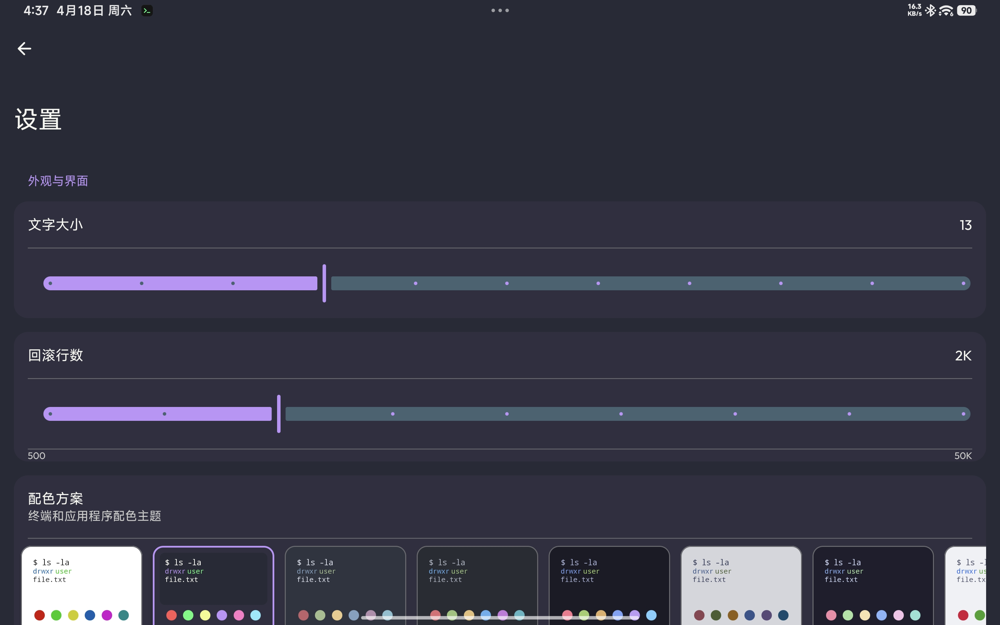
        <br/><sub>设置界面</sub>
      </td>
    </tr>
    <tr>
      <td align="center">
        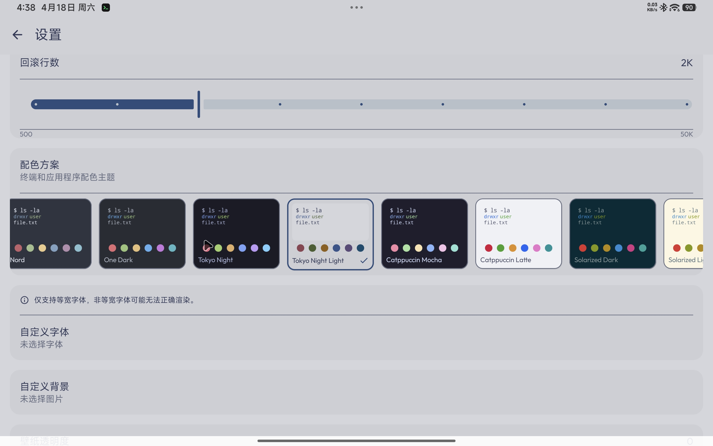
        <br/><sub>配色方案</sub>
      </td>
      <td align="center">
        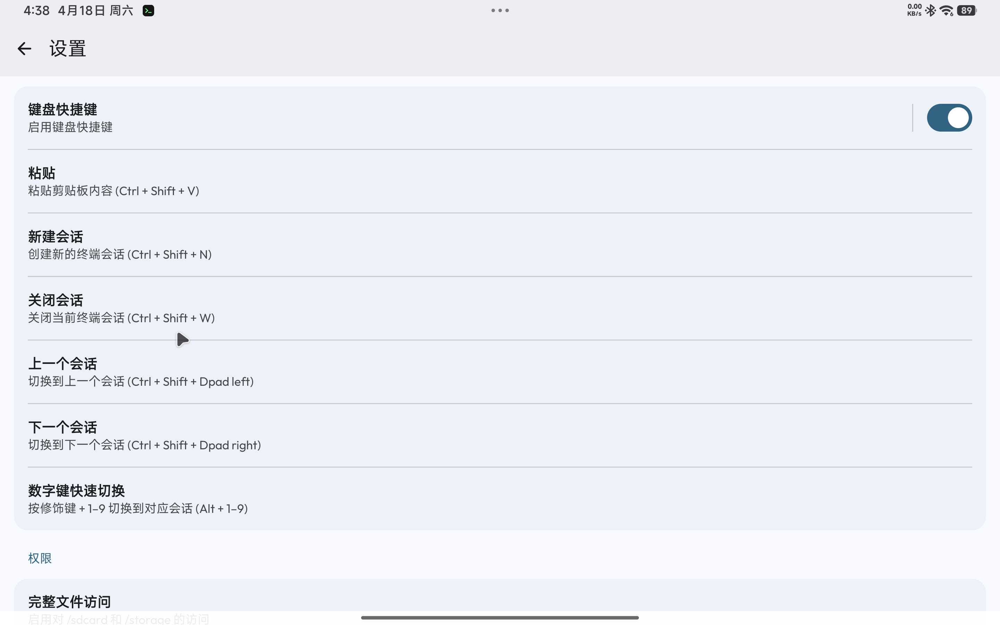
        <br/><sub>键盘快捷键</sub>
      </td>
      <td align="center">
        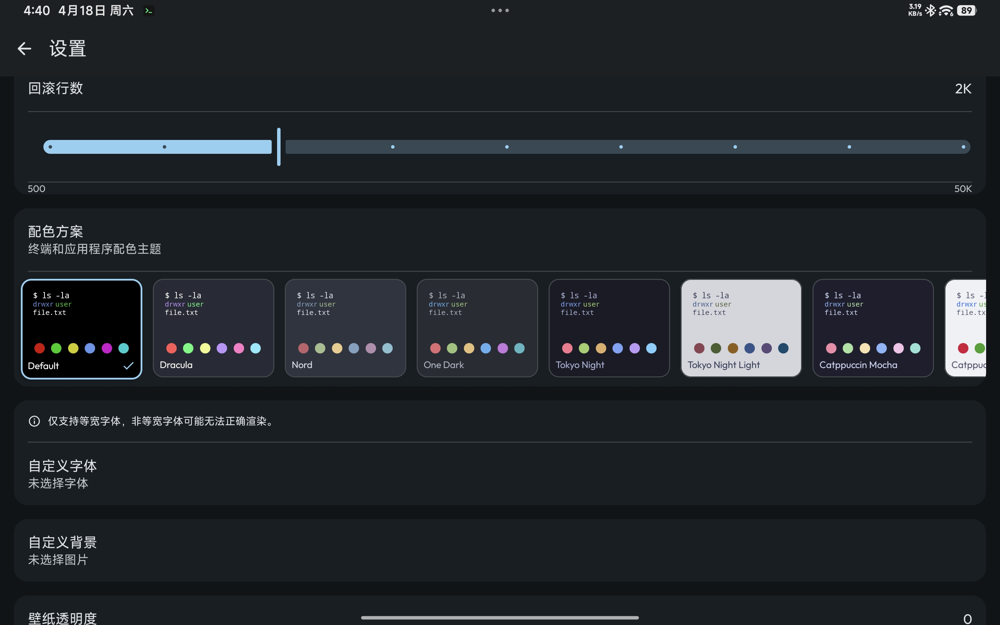
        <br/><sub>深色主题</sub>
      </td>
    </tr>
  </table>
</div>

---

## 下载与安装

### 直接下载 APK
访问本仓库的 [**Releases**](https://github.com/jeffusion/Termix/releases) 页面，下载最新版本的 APK 文件并安装。

> **注意**：若通过 GitHub Releases 安装，可能需要允许安装来自未知来源的应用。

### 系统要求
- **操作系统**：Android 8.0 (API 26) 及以上
- **架构支持**：`arm64-v8a`、`armeabi-v7a`、`x86_64`
- **权限需求**：
  - 存储权限（用于自定义字体/背景、文件访问）
  - 通知权限（用于前台服务状态通知）
  - 网络权限（用于首次运行时自动下载必要组件）

---

## 技术栈

| 类别 | 技术 |
| :--- | :--- |
| **开发语言** | Kotlin |
| **UI 框架** | Jetpack Compose + Material Design 3 |
| **底层终端** | [Termux TerminalView / TerminalEmulator](https://github.com/termux/termux-app) |
| **构建工具** | Gradle (Kotlin DSL) |
| **最低 SDK** | Android 8.0 (API 26) |
| **目标 SDK** | Android 9.0 (API 28) |
| **JDK 版本** | 17 |
| **CI/CD** | GitHub Actions |

### 项目结构

```
Termix/
├── app/                          # 应用入口模块
├── core/
│   ├── main/                     # 核心业务逻辑与 UI（Compose 界面、设置、会话管理）
│   ├── components/               # 通用 Compose 组件与 Preference 控件
│   ├── resources/                # 字符串、主题等公共资源
│   ├── terminal-emulator/        # 终端模拟器底层（Termux 衍生）
│   └── terminal-view/            # 终端渲染视图（Termux 衍生）
├── fastlane/                     # 应用商店元数据与截图
└── .github/workflows/            # GitHub Actions 工作流
```

---

## 自行构建

### 环境准备
1. 安装 [Android Studio](https://developer.android.com/studio)（推荐最新稳定版）
2. 确保已配置 JDK 17
3. 克隆本仓库：

```bash
git clone https://github.com/jeffusion/Termix.git
cd Termix
```

### 构建 Debug APK
```bash
./gradlew assembleDebug
```
构建完成后，APK 位于：
```
app/build/outputs/apk/debug/app-debug.apk
```

### 开发流程

仓库提供了一组适合日常开发使用的便捷命令，用于重新生成需要维护的资源并产出可测试的 APK。
大多数贡献者主要会用到 `make debug-apk`；只有在 launcher 相关资源发生变化时，才需要执行 `make icons`。

```bash
make icons      # 在 launcher 资源变更后重新生成图标
make debug-apk  # 构建 Debug 测试包
make all        # 先刷新需要维护的资源，再构建测试包
```

### 构建 Release APK
```bash
./gradlew assembleRelease
```
> **签名说明**：Release 构建支持通过 `signing.properties` 文件或环境变量注入签名信息。若未配置，将自动回退到内置的测试密钥（testkey）进行签名。

---

## 贡献指南

我们欢迎所有形式的贡献！无论是报告 Bug、提交功能建议，还是提交代码改进。

1. **Fork** 本仓库
2. 从 `main` 分支创建你的功能分支：`git checkout -b feature/amazing-feature`
3. 提交你的更改：`git commit -m 'Add some amazing feature'`
4. 推送到分支：`git push origin feature/amazing-feature`
5. 开启一个 **Pull Request**

### 代码规范
- 遵循项目现有的 Kotlin 代码风格
- 新增 UI 功能请尽量使用 Jetpack Compose 实现
- 确保本地 `./gradlew assembleDebug` 可以成功构建

---

## 开源许可

Termix 采用 [MIT License](LICENSE) 开源许可。

```
Copyright (c) 2024 Rohit Kushvaha

Permission is hereby granted, free of charge, to any person obtaining a copy
of this software and associated documentation files (the "Software"), to deal
in the Software without restriction, including without limitation the rights
to use, copy, modify, merge, publish, distribute, sublicense, and/or sell
copies of the Software, and to permit persons to whom the Software is
furnished to do so, subject to the following conditions:

The above copyright notice and this permission notice shall be included in all
copies or substantial portions of the Software.
```

---

## 致谢

- **[Termux](https://github.com/termux/termux-app)** — 提供了强大且稳定的 `TerminalView` 与 `TerminalEmulator` 基础
- **[ReTerminal](https://github.com/RohitKushvaha/ReTerminal)** — Termix 的 fork 源头项目
- **[Jackpal Android Terminal Emulator](https://github.com/jackpal/Android-Terminal-Emulator)** — Android 终端模拟器的先驱

---

<div align="center">
  <p><sub>Made with ❤️ for the Android terminal community</sub></p>
</div>
